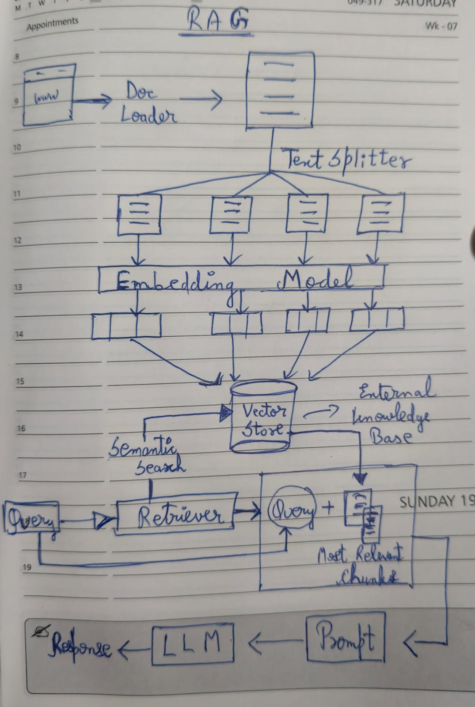

# Gen-AI RAG Based Document Q&A

## 🚀 Overview

**Gen-AI RAG Based Document Q&A** is an intelligent question-answering system that uses **Retrieval-Augmented Generation (RAG)** to empower AI with access to document content for factual, grounded answers. 

Unlike regular LLM responses that rely only on pre-trained knowledge, RAG systems fetch relevant sections from uploaded documents and combine them with generative models to provide accurate, context-aware answers. 

This repository includes:
- `main.py`: Core application logic for document ingestion, retrieval, and question processing.
- `rag_implement.ipynb`: Notebook showing implementation details and experimentation.
- `requirements.txt`: Python dependencies for the system. 

## 🧠 What Problem It Solves

Large language models typically cannot access content outside their training data. RAG solves this by:
1. **Indexing document contents** into a retrievable representation.
2. **Retrieving relevant chunks** for a user query.
3. **Augmenting response generation** with this document knowledge. 

This allows users to ask **questions grounded in the content of their own PDFs or text files** and get precise, detailed answers.

## 🧩 Features

- 📄 **Document Upload & Parsing**  
  Supports text, PDF ingestion and Youtube URL for RAG retrieval.

- 🔍 **Semantic Search**  
  Uses vector embeddings to find relevant document sections.

- 🧠 **Generative Q&A**  
  Answers user questions using retrieved document context.

- 📊 **Notebook Demonstrations**  
  Provides an interactive example of the RAG pipeline in `rag_implement.ipynb`. 

-📸 **Streamlit**
  Web-based UI for easier interaction and  real-time querying.

## 🛠 Tech Stack

- **Python** for implementing the RAG pipeline
- **LangChain** for document ingestion, chunking, embeddings, and retrieval  
- **Vector Store** (FAISS) for semantic search over document chunks  
- **Embedding Models**, Ollama for converting text into dense vector representations  
- **Large Language Model (LLM)**, Ollama for generating context-aware answers  
- **Jupyter Notebook** for experimentation

## 🧩 RAG Workflow

 

 

This diagram illustrates the end-to-end Retrieval-Augmented Generation (RAG)
pipeline, showing document ingestion, embedding generation, semantic retrieval,
and context-aware answer generation using a local LLM.

## 🔮 Future Enhancements

- Replace the current local **Ollama-based LLM** with a more capable model
  (larger open-source or hosted LLM) to improve reasoning and answer quality.

- Introduce a **better embedding model** to enhance semantic retrieval accuracy,
  especially for long or complex documents.

- Implement **metadata filtering** (document name, page number, section) to
  improve retrieval precision.

- Optimize chunking strategies and retrieval parameters for performance
  and scalability.

